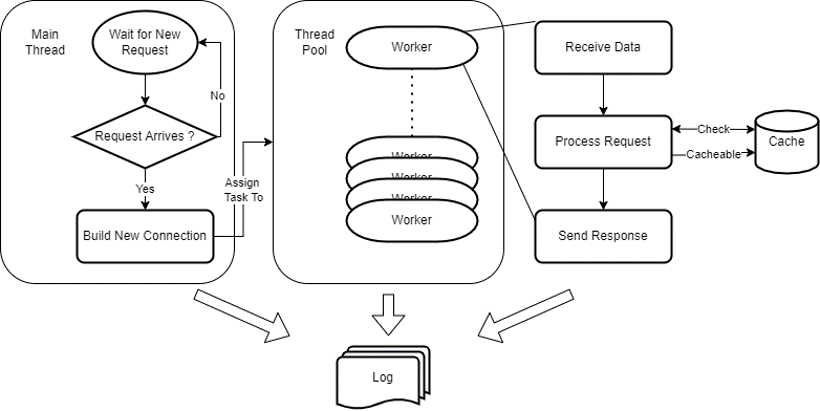
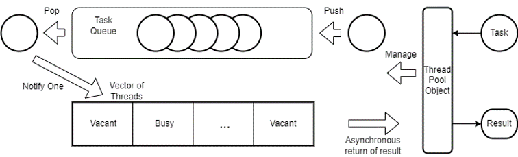
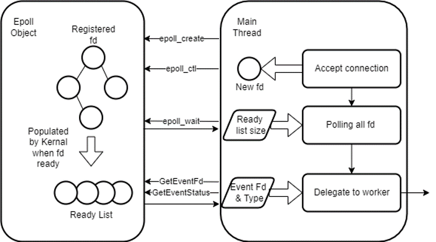

# Multithreaded Caching Proxy -- Project Report
## Members 
Meihong Ge mg476 /
Ruiqi Sun rs546

## Architercture Overview
The overall design of the server can be seen in the figure below:

The architecture can be first broken into three main segment, *Main Thread*, *Worker Threads*, and *Peripheral Component*.\
**Main Thread**: runs the base server object, it initialize all the necessary objects like ThreadPool, Logger, Cache, and Epoll. After the initialization stage, it proceed to loop and wait for incoming clients to make connections. This step is integrated into the Epoll object's management of file descriptors. More specifically, the epoll obejct monitors all the interested fd. Each iteration, the main thread gets a count of ready fds and traverse all of them to see if they are, new connections, ready for write, ready for read, or need shutting down. It then calls the corresponding handler function to handle the task, which is delegated to worker threads in the thread pool.\
**Worker Threads**: each thread handles a task passed through by the main thread, which includes of the three major steps, receive data, process request, and send responses. Together, they make up the complete proxy work flow, which will be convered in a later sections.\
**Peripheral Component**: here, peripheral refer to small gadget that enables certain functionalities and facilitate server performance. For our case of a proxy, we have the Cache as well as the Log, which again, will be covered in later sections.

## Multithreaded
For most server software out there, high concurrency and high availability has become a common requirement. One ensures the server can support a huge client traffic and the other one tries to prevent server from crashing or provides fail safe. With our current knowledge, we will begin with high concurrency since its more approachable and maybe look back and imporve its availability.

### Thread Pool
For a software to be highly concurrent, we need to improve its parallelizability, with a multi-core machine, either by running multiple processes or multiple threads (multiple coroutine, not used very widely yet). With lower switching cost and easier communication between thread, we adopted multithread model. The naïve way to do multithreading is by simply spawn a new thread when new request are received. This is going to be a simple implementation but would waste time in the repeated creation and deletion of threads, let alone higher possibility of server crashes if thread resources runs out. 
So we adopted the idea of `Thread Pool` for a better management of thread resources that we have. 

To be more specific, the thread pool object controls a task queue data structure to register new tasks. Whenever the task queue is not empty, idle thread in the thread pool is notified through conditional variable to wake up and handle the task. Task at the top of the queue is assigned to it and the result is returned asynchronously. However, since our handler function returns void, it really don't matter when the return happens.

### IO-Multiplexing
IO multiplexing is another important aspect for a server software to be highly concurrent. Every server has their own bottleneck that limit its performance. In our case, the bottleneck lies in the reading and writing of file descriptors, in other words, IO performance. Considering most of the computational work is parsing the headers and maybe reassemble them, CPU is not really holding us back. What we really don’t want is threads being blocked waiting for fds to be ready and we need a way to efficiently poll them to find the ready ones so we can pass them to worker thread.\
Some might wonder what does this has to do with high concurrency. So what we have here is not increasing the parallelizability but rather increasing the effeciency within each thread so we can handle larger overall traffic.\
If we just simply give the newly made connection to the worker thread, the thread might be blocked waiting for fd to be ready, or in non-blocking IO, repeatedly check if fd is ready. The wait here is unnecessary and would result in a huge cumulative difference.\
Hence, we utilized the epoll system calls and wrapped them in an object. 

Whenever a new fd comes through, it is added to the epoll object which uses a red-black tree to register all interested fds. When ready, the ready list is automatically populated by the kernel so we can use the provided interface to get the size of the ready list. With that, we can traverse the ready list to get access ready fds and their event type, namely new connection, read, write, or close connection. In this new approach, thread is given fd that is ready to be operated on so it can go on with all the work without being blocked. The wait time is tanked by the main thread, and since we are waiting for multiple fds to be ready parallelly, the aggregate wait time is smaller by magnitude.

## Proxy
The parsing of header is a sequential process that is not very technically complicated but rather composed of many details concerning the HTTP protocol. To put things clear and simple. We will focus on the three main steps which is receiving data, process request and send response.\
In the first step, HTTP header is parsed to acquire important information we need to make further processing, which inlcudes HTTP method, request identity(ip, port), protocol version (1.1? newer? HTTPS?), destination ip address and port. The parsing is a simple parse of strings by following the pattern in the HTTP RFC. 
In the second step, we make different actions based on the HTTP method. What we support is GET, POST, CONNECT. GET request since its cacheable, will first try to fetch response available in the cache and only make the request if its not there. POST request on the other hand, since it has to do with FORMS, are not cacheable and are directly relayed to the destination server. CONNECT request is usually seen when the website uses HTTPS, what it requires is for our proxy to open a tunnel with the destination server, so any further content received, is send to the destination with no need to process. With TLS, the proxy won't be able to decipher the message, only the two endpoints, client & server. What we do is have a select system call to monitor the two file descriptor, one with the client, one with the server, so when either of them is ready, forward the message directly.

## Caching
## Others